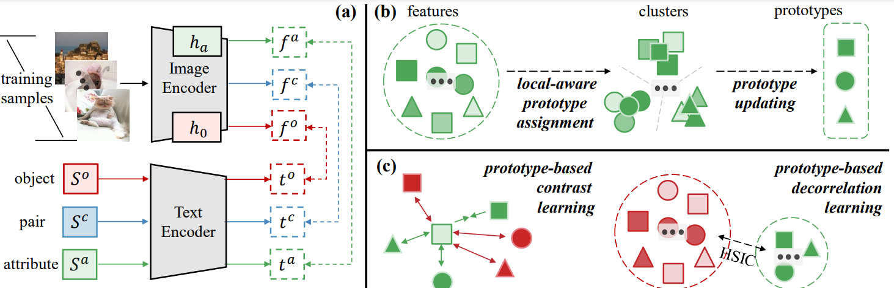

# Learning Clustering-based Prototypes for Compositional Zero-shot Learning (ICLR 2025)


>[Learning Clustering-based Prototypes for Compositional Zero-shot Learning](http://arxiv.org/abs/2502.06501) <br>
>[Hongyu Qu](https://quhongyu.github.io), [Jianan Wei](https://github.com/weijianan1), [Xiangbo Shu](https://shuxb104.github.io), [Wenguan Wang](https://sites.google.com/view/wenguanwang)

This is the official implementation of "Learning Clustering-based Prototypes for Compositional Zero-shot Learning" (Accepted at ICLR 2025).

## Abstract

Learning primitive (*i.e.*, attribute and object) concepts from seen compositions is the primary challenge of Compositional Zero-Shot Learning (CZSL). Existing CZSL solutions typically rely on oversimplified data assumptions, *e.g.*, modeling each primitive with a single centroid primitive representation, ignoring the natural diversities of the attribute (*resp.* object) when coupled with different objects (*resp.* attribute). In this work, we develop ClusPro, a robust clustering-based prototype mining framework for CZSL that defines the conceptual boundaries of primitives through a set of diversified prototypes. Specifically, ClusPro conducts within-primitive clustering on the embedding space for automatically discovering and dynamically updating prototypes. These representative prototypes are subsequently used to repaint a well-structured and independent primitive embedding space, ensuring intra-primitive separation and inter-primitive decorrelation through prototype-based contrastive learning and decorrelation learning. Moreover, ClusPro efficiently performs prototype clustering in a non-parametric fashion without the introduction of additional learnable parameters or computational budget during testing. Experiments on three benchmarks demonstrate ClusPro outperforms various top-leading CZSL solutions under both closed-world and open-world settings.

## Citation

If you find this work useful in your research, please star our repository and consider citing:

```
@inproceedings{qu2025learning,
      title={Learning Clustering-based Prototypes for Compositional Zero-shot Learning}, 
      author={Qu, Hongyu and Wei, Jianan and Shu, Xiangbo and Wang, Wenguan},
      booktitle={ICLR},
      year={2025}
}
```

## Contact

Any comments, please email: quhongyu@njust.edu.cn.
